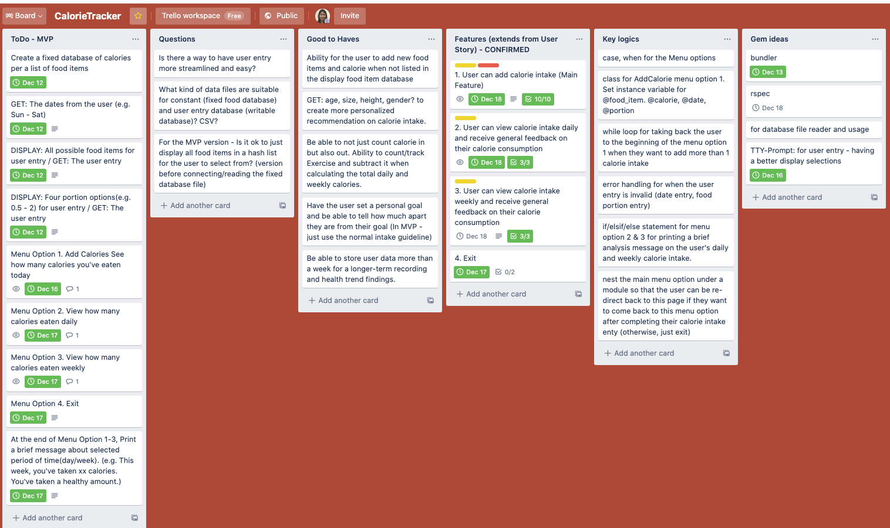
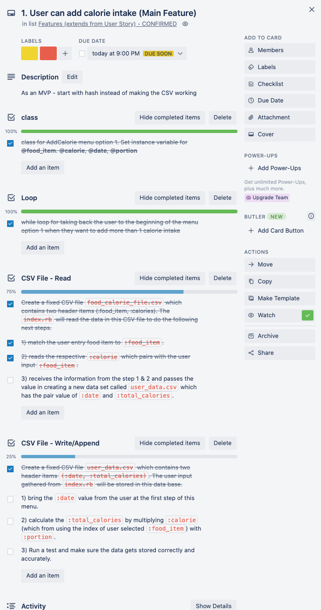
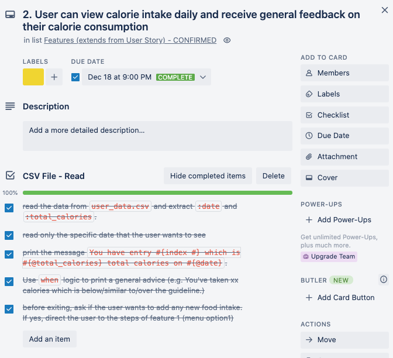
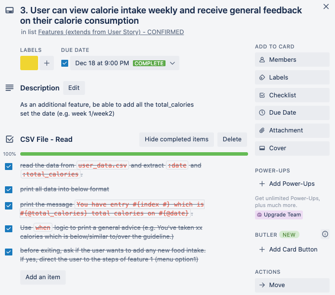

# Calorie_Counter_App
## R1. Answers to all the documentation requirements below.	
> Completed

## R2. Created a separate heading for each documentation requirement and organized answers accordingly.	
> Completed 

## R3. Referenced sources
### Using CSV files
https://www.sitepoint.com/guide-ruby-csv-library-part/
https://ruby-doc.org/stdlib-2.6.3/libdoc/csv/rdoc/CSV/Row.html

## R4. Source control repository link
https://github.com/SooyeonJeung/Calorie_Counter_App

 

## R5. Statement of Purpose & Scope
### The Application
The calorie counter app counts and tracks calories consumed and produce daily and weekly view of the user's progress over a selected period. The app offers easy usage and accurate tracking to the users without any prior major system setup. This app runs from the terminal.

### The Problem
For anyone interested in weight management, it is emotionally stressful to monitor and track personal calorie intake at all times. On top of this, it' tedious and error-prone to manually store and calculate the data. Finally, the data fail to produce something meaningful for the user to clearly understand their progress over time.

### The Solution
The calorie counter app solves this problem. The app is easy to use and navigate by any users. Once the users enter their calorie intakes, they gain full visibility of their calorie tracking and progress over the selected period. The app helps the users' weight management journey and gives them confidence in building the wellness routine.

### The Audience
Target Audience: Anyone interested to easily view and track the calories consumed is the target audience.

### The Usage
To start with, the user is given four(4) main menu, which are:
  1) Add new calorie intake: A user inputs dates, food items, and portions consumed. The user data gets stored and can be displayed when the user wants to view a daily or weekly view.
  2) View daily calorie intake: The user selects to view the total calorie consumption over a day. The app prints a dietary summary and a guideline to help the user understand their consumption. 
  3) View weekly calorie intake: The user selects to view the total calorie consumption over a day. The app prints a dietary summary and a guideline to help the user understand their consumption. 
  4) Exit: Enter to exit from the app.

For menu options 1-3, the user data can also be downloaded as it gets updated every time the system runs.

## R6. List of features
### 1. As a user, I want to be able to record my calorie intake.

### 2. As a user, I want to be able to calculate my calorie intake per day. 

### 3. As a user, I want to view my total calorie intake daily or weekly and receive an appropriate health recommendation.

Note: Ensure that your features above allow you to demonstrate your understanding of the following language elements and concepts:
- use of variables and the concept of variable scope
- loops and conditional control structures
- error handling

## R7. User Experience Details
### Menu Navigation 
The app provides clear instructions on what are the correct format and options available for them to enter. For every calorie intake, a user is asked to provide three inputs: date, food item, and portion. The user will be prompt with the options displayed in color green. The data will be re-printed after the user entry to confirm the data received. 

***(Used tools: TTY-Prmopt(ruby gem), Boolean)***

### Error Handling
The app has error handling functions, which includes error messages to the user. For example, when the user is unable to provide the correct entry, the system will prompt them to re-enter valid data. 

***(Used tools: rspec, Boolean)***

## R8. Control Flow Diagram
- show the workflow/logic and/or integration of the features in your application for each feature.
- utilise a recognised format or set of conventions for a control flow diagram, such as UML.

## R9. Implementation Plan 
**GitHub Repository**: [link here](https://github.com/SooyeonJeung/portfolio/tree/version-a)

**Trello Board**: [link here](https://trello.com/b/52cXJdyU/calorietracker)

## R10. How to install and use 

### To install and run
- `$ gem install bundler`
- `$ bundle install`
- `$ ruby index.rb `

### Dependencies
- Ruby

### System/Hardware requirements

