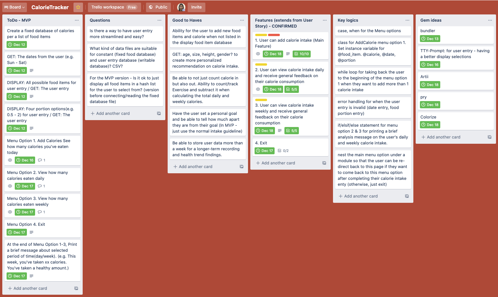
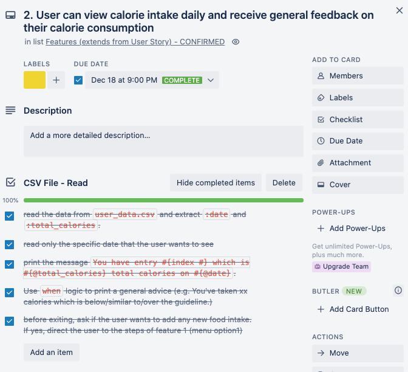
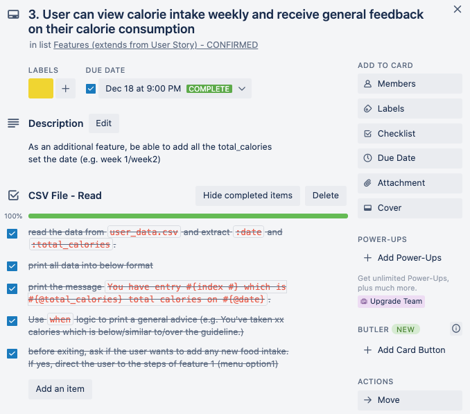

# Calorie Counter Application
## R1. Answers to all the documentation requirements below.	
> Completed

 

## R2. Created a separate heading for each documentation requirement and organized answers accordingly.	
> Completed 

 

## R3. Referenced sources
### Using CSV files
https://ruby-doc.org/stdlib-2.6.3/libdoc/csv/rdoc/CSV/Row.html  
https://ruby-doc.org/stdlib-2.6.1/libdoc/csv/rdoc/CSV.html  
https://docs.ruby-lang.org/en/2.0.0/CSV.html  
https://stackoverflow.com/questions/12407035/ruby-csv-get-current-line-row-number/12408934  
https://www.sitepoint.com/guide-ruby-csv-library-part/

 

## R4. Source control repository link
**GitHub Repository**: [link here](https://github.com/SooyeonJeung/Calorie_Counter_App)

 

## R5. Statement of Purpose & Scope
### The Application:
The calorie counter app counts and tracks calories consumed and produce daily and weekly view of the user's progress over a selected period. The app offers easy usage and accurate tracking to the users without any prior major system setup. This app runs from the terminal.

### The Problem:
For anyone interested in weight management, it is emotionally stressful to monitor and track personal calorie intake at all times. On top of this, it' tedious and error-prone to manually store and calculate the data. Finally, the data fail to produce something meaningful for the user to clearly understand their progress over time.

### The Solution:
The calorie counter app solves this problem. The app is easy to use and navigate by any users. Once the users enter their calorie intakes, they gain full visibility of their calorie tracking and progress over the selected period. The app helps the users' weight management journey and gives them confidence in building the wellness routine.

### The Audience:
Target Audience: Anyone interested to easily view and track the calories consumed is the target audience.

### The Usage:
To start with, the user is given four(4) main menu, which are:
  1) Add new calorie intake: A user inputs dates, food items, and portions consumed. The user data gets stored and can be displayed when the user wants to view a daily or weekly view.
  2) View daily calorie intake: The user selects to view the total calorie consumption over a day. The app prints a dietary summary and a guideline to help the user understand their consumption. 
  3) View weekly calorie intake: The user selects to view the total calorie consumption over a day. The app prints a dietary summary and a guideline to help the user understand their consumption. 
  4) Exit: Enter to exit from the app.

For menu options 1-3, the user data can also be downloaded as it gets updated every time the system runs.

 

## R6. List of features
### Main Menu:
  - **Class:** to call the instance variables continuously
    - Define class AddCalorie
    - Initialize objects
    - create instance variables
      - @date = ''
      - @food_item = ''
      - @portion = 0.0
      - @calorie = 0
      - @prompt = TTY::Prompt.new
      - @food_calorie_table = CSV.read("food_calorie_file.csv", headers: true, header_converters: :symbol)
    - added attr_accessor/reader  
      - attr_accessor :date, :food_item, :portion
      - attr_reader :calorie

  - **Method:** to break the codes into methods for code readability and usability for additional features
    - Art: for Artii gem usage
    - welcome: print welcome message
    - initialize: class/main
    - user_select: user input controller
    - find_food_item: reading/printing the food items fron constant csv file
    - handle_input: main method for handling different menu options

### Feature 1: Add Calorie Intake**
A user wants to inputs dates, food items, and portions consumed. The user data gets stored, and the user can add another calorie intake. 
  - Loop: while loop for taking back the user to the beginning of the menu option 1 when they want to add more than 1 calorie intake 
  - if/else: to go back to start when the user wants to add a new calorie intake
  - CSV file: 
    - `CSV.foreach("food_calorie_file.csv", options).with_index do |(f,c), i|`: to read the data from `food_calorie_file.csv` and extract `food_item` and `calorie` values with their index number.
    - `CSV.open("user_data.csv", "a+")`: to create items (`date`, `total_calories`) in the user data csv file

### Feature 2: View daily calorie intake and get a daily summary**
A user wants to view the total calorie consumption over a selected day. The app prints a dietary summary and a guideline to help the user understand their total calorie intake per day.   
  - if/elsif/else: 
    - to give proper health recommendation to the users per their `daily_total_calories`
    - to have the user go back to menu option 1 to add new calorie intake. (used `AddCalories.new().handle_input`)
  - CSV file: 
    - `CSV.foreach("user_data.csv", options).with_index do |(d,t), i|`: to read the user data and extract `date` and `total_calories`. The total calories of the selected date will be all added. (`t = t.to_i` `daily_total_calorie += t`)

### Featue 3: View weekly calorie intake and get a weekly summary**
A user wants to view the total calorie consumption over a week. The app prints a dietary summary of the week, and the average calorie per meal. Finally, it prints guidelines to help the user understand their overall consumption.    
  - if/elsif/else: 
    - to give proper health recommendation to the users per their `avg_cal`
    - to have the user go back to menu option 1 to add new calorie intake. (used `AddCalories.new().handle_input`)
  - CSV file: 
    - `CSV.foreach("user_data.csv", options).with_index do |(d,t), i|`: to read the user data and extract `date` and `total_calories`. All data under `total_calories` heading will be stored in `weekly_array`. With `.shift` iterator, and `.uniq`, total_calories can be filtered by each dates.

 

## R7. User Experience Details
### **Clear Menu Navigation:** 
The app provides clear instructions on what are the correct format and options available for them to enter. For every calorie intake, a user is asked to provide three inputs: date, food item, and portion. The user will be prompt with the options displayed in color green. The data will be re-printed after the user entry to confirm the data received. 

***(Used tools: TTY-Prmopt(ruby gem), Boolean)***

### **Error Handling:**
The app has error handling functions, which include error messages to the user. For example, when the user is unable to provide the correct entry, the system will prompt them to re-enter valid data. 
 
In this application, below measures has been taken to anticipate the errors and minimize the user impact. 
- begin/rerscue
- when/else
- boolean(if/elsif/else)
- data structure (e.g. .to_i/.to_f, value = 0.0, @date = ‘’)
- TTY-Prompt
- Pry
- clear instructions

***(Used tools: TTY-Prompt, Boolean, Pry)***

### **Visual Effects:**
The app starts with a welcome sign with the two gems installed through bundler, Artii and Colorize. Distinction lines are displayed (...) to seperate the contents and make it easier for the user to read through. For all selections, color green is used. For all confirmation/data print, light blue is used. Finally color cyran is used for printing health recommendation to the users.  

***(Used tools: TTY-Prompt, Artii, Colorize)***

 

## R8. Control Flow Diagram
After scribbling notes and sketches on my initial app idea, the first step of conceptualizing my idea was through a flow chart. 

From the start, I draw my flow chart with heavy details. I thought through the logic structures and sequence of each step, and therefore, not much changes was needed while implementation.

 

## R9. Implementation Plan 
From the flow chart to implementation, I actively used the Trello board to layout my implementation plan and track the progress diligently. I used GitHub to store the codes and to create a new branch for features specific coding and testing. 

### Trello Checklists/Timeline ([link here](https://trello.com/b/52cXJdyU/calorietracker))
I structured my Trello board into 6 lists. The Todo MVP and Features lists have descriptions, deadlines, labels, and checklists for each item. My Trello board is publicly available, so the readers can check my board. Below is a brief written summary for README. 

- Todo MVP (highest priority, urgent) -> The app should be able to work on MVP version.
- Questions (medium priority, continuous)
- Good to Haves (low priority, long-term) -> ideas for later advanced features
- Features (highest priority, time-consuming and invest into fixing the bug/making the details work)
- Key logics (high priority, iterations may be needed while coding)
- Gem installations (medium-to-low priority, get the essentials needed gems first and then install other gems to improve the code/user experience)

### CSV file usage
- **Feature 1 (Add Calorie Intake):**
  - **CSV File - Read**: Create a fixed CSV file `food_calorie_file.csv` which contains two header items `(:food_item, :calories)`. The `index.rb` will read the data in this CSV file to do the following next steps
    - match the user entry food item to `:food_item`
    - read the respective `:calorie` which pairs with the user input  `:food_item`
    - receive the information from the step 1 & 2 and passes the value in creating a new data set called `user_data.csv` which has the pair value of `:date` and `:total_calories`
  - **CSV File - Write/Append**: Create a fixed CSV file `user_data.csv` which contains two header items `(:date, :total_calories)`. The user input gathered from `index.rb` will be stored in this data base
    - bring the `:date` value from the user at the first step of this menu
    - calculate the `:total_calories` by multiplying `:calorie` (which from using the index of user selected `:food_item`) with `:portion`
    - run a test and make sure the data gets stored correctly and accurately

- **Feature 2 (View daily calorie intake and get a daily summary):**
    - **CSV File - Read**:
      - read the data from `user_data.csv` and extract `:date` and `:total_calories`
      - read only the specific date that the user wants to see `require "csv"` 
      - print the message `You have entry #{index #} which is #{@total_calories} total calories on #{@date}`  - use instance variables
      - Use `when` logic to print a general advice (e.g. You've taken xx calories which is below/similar to/over the guideline.)
      - before exiting, ask if the user wants to add any new food intake. If yes, direct the user to the steps of feature 1 (menu option1) - (while loop, if/elsif/else) 

- **Feature 3 (View daily calorie intake and get a weekly summary):**
  - **CSV File - Read**: 
    - read the data from `user_data.csv` and extract `:date` and `:total_calories`
    - print all data into below format
    - print the message `You have entry #{index #} which is #{@total_calories} total calories on #{@date}` - use instance variables
    - Use `when` logic to print a general advice (e.g. You've taken xx calories which is below/similar to/over the guideline.) - create new array to create a mathmetical formula.
    - before exiting, ask if the user wants to add any new food intake. If yes, direct the user to the steps of feature 1 (menu option1) - (while loop, if/elsif/else) 

- **Error Handling: Refer to the details in R7**
- **Gems:**
  - Bundler
  - Pry
  - TTY-Prompt 
  - Artii
  - Colorize

## R10. How to install and use 
Ensure that your server has the ruby installed. Refer to [this document](https://www.ruby-lang.org/en/downloads/) for ruby installation. Next is to install a gem bundler. Use the command `$ gem install bundler` and `$ bundle install`. The bundler gem will auto-download all other gems installed to use this application. In your command line, input `$ ruby index.rb ` to run the CLI application.

The user will be welcomed with an intro message indicating the four menu options. The user can select the menu option that they wish to navigate. For each menu option, the prompt will be displayed with available selections so that the user can enter valid input with no doubt. 

Error handling is covered in this application by anticipating the potential errors and implementing error handling tools as mentioned in detail in R7.

### **Dependencies**
- Ruby
- rbenv
- Gem install

## R11-R12 Presentation attached
> Completed

## R13-R19 Code Requirements 
> Completed